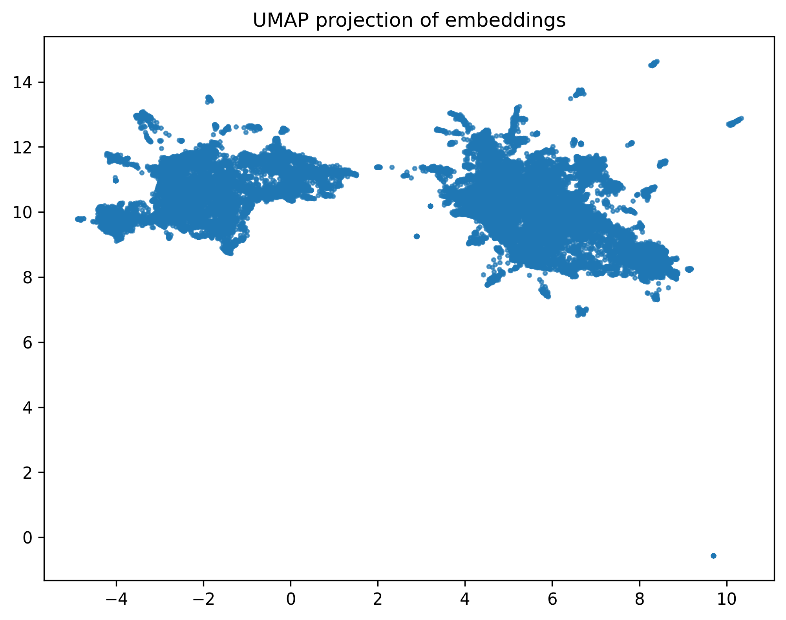

Проект **DishGenerator** интегрируется с веб-приложением **DineWithFriends** и позволяет генерировать новые блюда на основе предпочтений пользователя.  

---

## Как это работает

### Обучение (Train)

- Используется датасет рецептов и отзывов с [Kaggle: Food.com Recipes and Reviews](https://www.kaggle.com/datasets/irkaal/foodcom-recipes-and-reviews).  
- Для каждого блюда текст (название, описание, ингредиенты, категория, ключевые слова) преобразуется в числовой вектор с помощью **Sentence Transformer**. Это позволяет моделировать семантическое сходство между блюдами.  
- С помощью **UMAP** эмбеддинги блюд проецируются в 2D пространство:  

  

- На визуализации видно **два явных кластера**, поэтому для кластеризации данных используется **K-means на 2 кластера**.  
  - Один кластер соответствует **основным блюдам**  
  - Второй - **десертам**  

- Анализ кластера основных блюд не показывает явной структуры подкластеров:  

  

---

### Генерация (Generate)

1. Преобразуем рецепты пользователя в нужный формат и применяем **Sentence Transformer**.  
2. Классифицируем рецепты по кластерам.  
3. Находим центр эмбеддингов пользовательских блюд в каждом кластере.  
4. Предлагаем **рандомный рецепт из пяти ближайших к центру**.  
5. С вероятностью 0.9 выбираем кластер **основных блюд**, чтобы предложения чаще попадали в эту категорию.  
